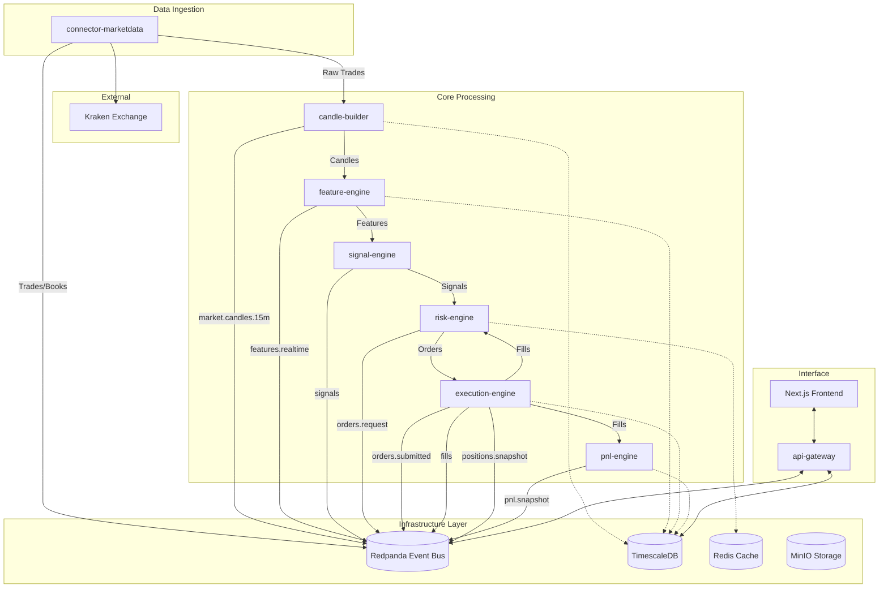

# Quantitative Trading System Design Specification

## 0. Context & Objectives

**Goal:** Build a modular, scalable quantitative trading system focused on real economic profitability.
**Key Principles:**
- No overfitting or data leakage.
- Maximize execution quality.
- Measure all economic metrics (PnL, drawdown, slippage, fees).
- Strict risk management.

**Market Scope:**
- Exchange: Kraken (Spot)
- Pairs: BTC/USDT, ETH/USDT
- Timeframe: 15 minutes

---

## 1. Technology Stack

### Backend
- **Language:** Python 3.11
- **API Framework:** FastAPI
- **Data Validation:** Pydantic v2
- **ORM:** SQLAlchemy (Async) + Alembic
- **Exchange Connector:** ccxt (Kraken)
- **Backtesting:** vectorbt
- **Data Analysis:** pandas, numpy, pandas-ta
- **Logging:** structlog

### Infrastructure
- **Containerization:** Docker + Docker Compose
- **Event Bus:** Redpanda (Kafka compatible)
- **Database:** TimescaleDB (PostgreSQL)
- **Cache/State:** Redis
- **Object Storage:** MinIO (Local S3)
- **Observability:** Prometheus + Grafana + Loki

### Frontend
- **Framework:** Next.js (App Router)
- **Language:** TypeScript
- **Styling:** TailwindCSS
- **Charts:** Recharts, lightweight-charts
- **State Management:** Zustand, TanStack Query
- **Realtime:** WebSocket

---

## 2. Architecture

### High-Level Diagram



---

## 3. Event Bus (Redpanda)

### Topics
| Topic Name | Retention | Compaction | Description |
|------------|-----------|------------|-------------|
| `market.trades` | 1h | No | Raw trade stream |
| `market.candles.15m` | 7d | No | OHLCV data |
| `features.realtime` | 24h | No | Calculated indicators |
| `signals` | 24h | No | Strategy signals |
| `orders.request` | 24h | No | Signals validated aiming for execution |
| `orders.submitted` | 24h | No | Orders sent to exchange |
| `fills` | Permanent | Yes | Execution reports |
| `positions.snapshot` | 24h | Yes | Current portfolio state |
| `pnl.snapshot` | Permanent | No | PnL tracking log |
| `risk.events` | 7d | No | Risk checks and rejections |
| `system.health` | 24h | Yes | Heartbeats and alerts |

### Schemas

**Common Metadata:**
```json
{
  "event_id": "uuid",
  "idempotency_key": "string",
  "event_time": "ISO8601 UTC",
  "ingest_time": "ISO8601 UTC",
  "symbol": "BTC/USDT",
  "exchange": "kraken"
}
```

**SigalEvent:**
```json
{
  "strategy_id": "string",
  "signal_type": "ENTRY_LONG | EXIT_LONG | ...",
  "strength": 1.0,
  "reason": "metadata about why"
}
```

**OrderRequestEvent:**
```json
{
  "order_id": "uuid",
  "side": "buy | sell",
  "type": "market | limit",
  "quantity": "decimal",
  "price": "decimal (optional)",
  "leverage": 1
}
```

---

## 4. Database Schema (TimescaleDB)

### Tables

```sql
-- Candles (Hypertable)
CREATE TABLE candles_15m (
    time TIMESTAMPTZ NOT NULL,
    symbol TEXT NOT NULL,
    open DOUBLE PRECISION,
    high DOUBLE PRECISION,
    low DOUBLE PRECISION,
    close DOUBLE PRECISION,
    volume DOUBLE PRECISION,
    trades INT,
    PRIMARY KEY (time, symbol)
);
SELECT create_hypertable('candles_15m', 'time');

-- Features
CREATE TABLE features (
    time TIMESTAMPTZ NOT NULL,
    symbol TEXT NOT NULL,
    feature_name TEXT NOT NULL,
    value DOUBLE PRECISION,
    PRIMARY KEY (time, symbol, feature_name)
);
SELECT create_hypertable('features', 'time');

-- Orders
CREATE TABLE orders (
    order_id UUID PRIMARY KEY,
    symbol TEXT,
    side TEXT,
    type TEXT,
    status TEXT,
    created_at TIMESTAMPTZ,
    updated_at TIMESTAMPTZ
);

-- Fills
CREATE TABLE fills (
    fill_id UUID PRIMARY KEY,
    order_id UUID,
    symbol TEXT,
    price DOUBLE PRECISION,
    quantity DOUBLE PRECISION,
    fee DOUBLE PRECISION,
    fee_currency TEXT,
    timestamp TIMESTAMPTZ
);

-- PnL Snapshots
CREATE TABLE pnl_snapshots (
    time TIMESTAMPTZ NOT NULL,
    total_equity DOUBLE PRECISION,
    realized_pnl DOUBLE PRECISION,
    unrealized_pnl DOUBLE PRECISION,
    positions_value DOUBLE PRECISION,
    cash_balance DOUBLE PRECISION,
    currency TEXT DEFAULT 'USDT'
);
SELECT create_hypertable('pnl_snapshots', 'time');
```

---

## 5. Features (MVP)

All calculated on `close` of the 15m candle. **Lag 1** applied strictly to avoid lookahead bias.

1.  **log_return_1**: `ln(CLOSE / CLOSE[t-1])`
2.  **log_return_{3,6}**: Rolling sum of log returns.
3.  **volatility_14**: Rolling std dev of log returns * sqrt(14).
4.  **rsi_14**: Standard RSI.
5.  **macd**: Fast(12) - Slow(26). Signal(9).
6.  **atr_14**: Average True Range.
7.  **zscore_price_20**: `(price - ma_20) / std_20`
8.  **ma_fast_20 / ma_slow_100**: SMAs.
9.  **trend_strength**: `abs(ma_20 - ma_100) / ar_100`

---

## 6. Strategies

Implemented via `StrategyPlugin` interface.

**1. Trend / Momentum**
- **Entry:** `MA_20 > MA_100` AND `Close > MA_20`.
- **Filter:** `ATR > Threshold` (avoid chop).
- **Exit:** `MA_20 < MA_100` OR `Price < Entry - 2*ATR` (Stop Loss).

**2. Mean Reversion**
- **Entry:** `zscore_price_20 < -2`.
- **Exit:** `zscore_price_20 > 0` (Mean revert) OR `Time > 12 bars` (Time stop).

**3. Breakout**
- **Entry:** `Close > Donchian_High_20`.
- **Exit:** Trailing stop based on `Low_20`.

---

## 7. Risk Engine (Critical)

**Global Limits:**
- Max Daily Loss: 2% (Circuit Breaker triggered if crossed).
- Max Total Exposure: 30% of Equity.
- Max Open Positions: 2.
- Kill Switch: Manual override in UI.

**Position Sizing:**
- Formula: `(Equity * Risk_Per_Trade) / (ATR * Multiplier)`
- Normalizing risk per trade to e.g., 1% account risk per bet.

**Checks:**
- Pre-trade: Check if limits are exceeded.
- Post-trade: Monitor PnL for stops.

---

## 8. Execution Engine

**Paper Mode:**
- Simulate order latency (e.g., random 50-200ms sleep).
- Simulate fill price: `Last Price +/- Slippage`.
- Slippage model: 5 bps (0.05%) penalty on every trade.
- Record "simulated" fees (Kraken tier: 0.26%).

**Live Mode:**
- ccxt private API calls.
- Nonce and Idempotency handling.
- Balance reconciliation loop.

---

## 9. Backtesting & Validation

**Tool:** `vectorbt`

**Configs:**
- `fees=0.0026` (0.26%)
- `slippage=0.0005` (0.05%)
- `freq='15m'`

**Metrics:**
- Total Return / CAGR
- Max Drawdown
- Sharpe Ratio
- Sortino Ratio
- Win Rate
- Profit Factor
- Expectancy (Avg Win / Avg Loss)

---

## 10. Frontend (Next.js)

**Pages:**
- `/dashboard`: High level KPI cards, Equity Curve, Active Positions.
- `/markets/[symbol]`: TradingView-style chart (Lightweight Charts), Indicators overlay, Trade markers.
- `/strategies`: Status of each strategy plugin, local metrics.
- `/execution`: Order history, Fill history, Latency metrics.
- `/risk`: Current usage of limits, Daily PnL tracker.
- `/system`: Component health (green/red dots), log stream.

---

## 11. Infrastructure & Docker

**Services in `docker-compose.yml`:**
1.  **redpanda**: Event Bus.
2.  **timescaledb**: Data Warehouse.
3.  **redis**: Realtime State.
4.  **minio**: Artifact/Blob storage.
5.  **prometheus**: Metrics collection.
6.  **grafana**: Visualization.
7.  **loki**: Log aggregation.
8.  **api-gateway**: Backend entrypoint.
9.  **frontend**: Next.js UI.
10. **workers**: (market-data, feature-engine, etc... can be combined in dev).

**Resource Optimization (For 2GB RAM):**
- Strict memory limits on containers.
- Use of swap file (4GB recommended).
- Combined "monolith" worker for Python services in local dev to save overhead.

---

## 12. Milestones

- **M1: Foundation:** Infrastructure (Docker, Redpanda, DB), Market Data ingestion, Candle storage, Dashboard skeleton.
- **M2: Core Logic:** Feature Engine, Strategy Interface, 1 Strategy (Trend), Paper Execution, Equity plotting.
- **M3: Validation:** Backtesting engine (vectorbt), 3 Strategies implemented, Full Risk Engine.
- **M4: Live Ready:** Live Execution adapter, Production hardening, Security audit.
